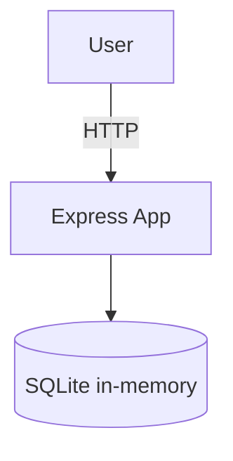

# DFD (tiny) + STRIDE summary

| Threat | Example | Mitigation |
|---|---|---|
| Spoofing | Weak JWT secret (demo mode) | Strong secret in safe mode; env var in CI |
| Tampering | SQL concat in login | Parameterised query (safe path) |
| Repudiation | Minimal logs | Add JSON logs if needed |
| Info Disclosure | IDOR /tasks/:id | Enforce ownership in safe path |
| DoS | No rate limiting | Add simple limits if needed |
| EoP | Excessive claims | Minimal JWT claims |
